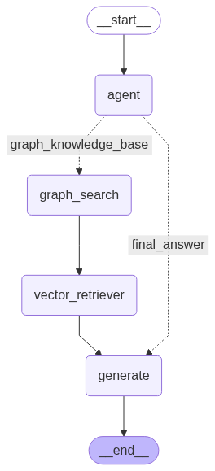
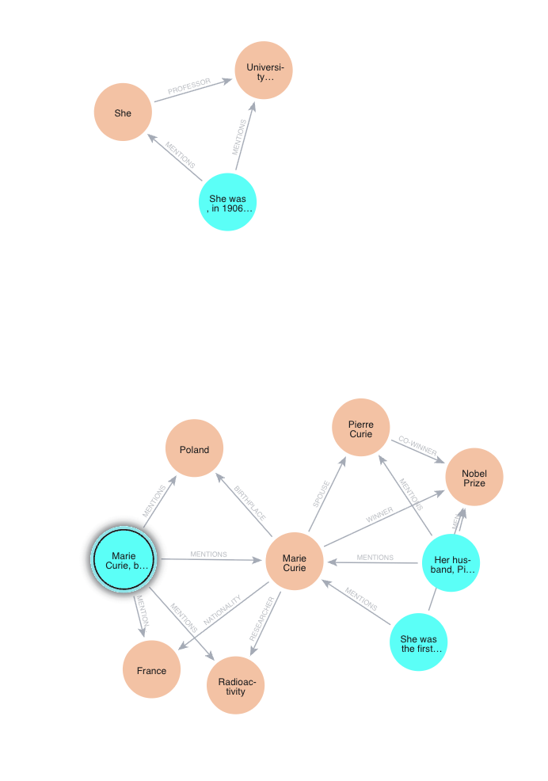

# The Graph RAG template with LangGraph and Neo4j 🚀

## 📖 Table of Contents
* [Introduction](#-introduction)  
* [Directory structure and file descriptions](#-directory-structure-and-file-descriptions)  
* [Prerequisites](#-prerequisites)  
* [Installation](#-installation)
* [Configuration](#%EF%B8%8F-configuration)  
* [Modifying and configuring the template](#-modifying-and-configuring-the-template)  
* [Create a knowledge graph](#create-a-knowledge-graph-optional)
* [Running the application locally](#-running-the-application-locally)  
* [Deploying on IBM Cloud](#%EF%B8%8F-deploying-on-ibm-cloud)  
* [Querying the deployment](#-querying-the-deployment)  
* [Running the graphical app locally](#%EF%B8%8F-running-the-graphical-app-locally) 
* [Cloning template (Optional)](#-cloning-template-optional)   


##  🤔 Introduction

This repository provides a Graph RAG template for LLM apps built using LangGraph framework. It also makes it easy to deploy them as an AI service as part of IBM watsonx.ai for IBM Cloud[^1].  
An AI service is a deployable unit of code that captures the logic of your generative AI use case. For and in-depth description of the topic please refer to the [IBM watsonx.ai documentation](https://dataplatform.cloud.ibm.com/docs/content/wsj/analyze-data/ai-services-templates.html?context=wx&audience=wdp).  


The template includes an application that solves the RAG problem using a hybrid approach, in which the knowledge graph, using the `Neo4j` graph database management system, is enriched with vector similarity search. For more information about the `Neo4j` integration in LangChain, i.e. `langchain_neo4j` library and its components, please refer to the official documentation pages: [Neo4j](https://python.langchain.com/docs/integrations/graphs/neo4j_cypher/) and [Neo4j Vector Index](https://python.langchain.com/docs/integrations/vectorstores/neo4jvector/). Furthermore, please also check the [article](https://blog.langchain.com/enhancing-rag-based-applications-accuracy-by-constructing-and-leveraging-knowledge-graphs/) on LangChain Blog which was the basis for the creation of Graph RAG Agent.

The structure of Graph RAG workflow:



> [!NOTE]  
> One of the prerequisites for running Graph RAG agents is having a running instance of `Neo4j`. For local testing, you can run database using docker container. To start a local docker container with the `Neo4j` database, run the following command.
>
>```console
>$ docker run \
>    --name neo4j \
>    -p 7474:7474 -p 7687:7687 \
>    -d \
>    -e NEO4J_AUTH=neo4j/password \
>   -e NEO4J_PLUGINS=\[\"apoc\"\]  \
>    neo4j:latest
>```
>
> Furthermore, when running the Graph RAG agent, the knowledge agent should already exist. Please refer to the section [Create a knowledge graph](#create-a-knowledge-graph-optional) to see how you can create a knowledge graph from raw text using the `/scripts/create_knowledge_graph.py` script and what indexes are required to search effectively the graph.
 

**Highlights:**

* 🚀 Easy-to-extend agent and tool modules
* ⚙️ Configurable via `config.toml`
* 🌐 Step-by-step local and cloud deployment

[^1]: _IBM watsonx.ai for IBM Cloud_ is a full and proper name of the component we're using in this template and only a part of the whole suite of products offered in the SaaS model within IBM Cloud environment. Throughout this README, for the sake of simplicity, we'll be calling it just an **IBM Cloud**. 

## 🗂 Directory structure and file descriptions

The high level structure of the repository is as follows:  

```
langgraph-graph-rag/
├── src/
│   └── langgraph_graph-rag/
│       ├── agent.py
│       └── nodes.py
├── schema/
├── ai_service.py
├── config.toml.example
├── template.env
└── pyproject.toml
``` 

* **`langgraph-graph-rag`** folder: Contains auxiliary files used by the deployed function. They provide various framework specific definitions and extensions. This folder is packaged and sent to IBM Cloud during deployment as a [package extension](https://dataplatform.cloud.ibm.com/docs/content/wsj/analyze-data/ml-create-custom-software-spec.html?context=wx&audience=wdp#custom-wml).  
* **`schema`** folder: Contains request and response schemas for the `/ai_service` endpoint queries.  
* **`ai_service.py`** file: Contains the function to be deployed as an AI service defining the application's logic  
* **`config.toml.example`**: A configuration file with placeholders that stores the deployment metadata. After downloading the template repository, copy the contents of the `config.toml.example` file to the `config.toml` file and fill in the required fields. `config.toml` file can also be used to tweak the model for your use case. 
* **`template.env`**: A file with placeholders for necessary credentials that are essential to run some of the `ibm-watsonx-ai-cli` commands and to test agent locally. Copy the contents of the `template.env` file to the `.env` file and fill the required fields.

## 🛠 Prerequisites

* **Python 3.11**
* **[Poetry](https://python-poetry.org/)** package manager (install via [pipx](https://github.com/pypa/pipx))
* IBM Cloud access and permissions


## 📥 Installation

To begin working with this template using the Command Line Interface (CLI), please ensure that the IBM watsonx AI CLI tool is installed on your system. You can install or upgrade it using the following command:

1. **Install CLI**:

   ```sh
   pip install -U ibm-watsonx-ai-cli
   ```

2. **Download template**:
   ```sh
   watsonx-ai template new "community/langgraph-graph-rag"
   ```

   Upon executing the above command, a prompt will appear requesting the user to specify the target directory for downloading the template. Once the template has been successfully downloaded, navigate to the designated template folder to proceed.

    > [!NOTE]
    > Alternatively, it is possible to set up the template by cloning the template's repository directory. For detailed instructions, please refer to the section "[Cloning template (Optional)](#-cloning-template-optional)".

3. **Install Poetry**:

   ```sh
   pipx install --python 3.11 poetry
   ```

4. **Install the template**:

    Running the below commands will install the repository in a separate virtual environment
   
   ```sh
   poetry install --with dev
   ```

5. **(Optional) Activate the virtual environment**:

   ```sh
   source $(poetry -q env use 3.11 && poetry env info --path)/bin/activate
   ```

6. **Export PYTHONPATH**:

   Adding working directory to PYTHONPATH is necessary for the next steps.

   ```sh
   export PYTHONPATH=$(pwd):${PYTHONPATH}
   ```

## ⚙️ Configuration

1. Copy `template.env` → `.env`.
2. Copy `config.toml.example` → `config.toml`.
2. Fill in IBM Cloud credentials and AI service online parameters.

## 🎨 Modifying and configuring the template

[config.toml](config.toml) and [.env](.env) files should be filled in before either deploying the template on IBM Cloud or executing it locally.  
Possible config parameters are given in the provided file and explained using comments (when necessary).  


The template can also be extended to provide additional key-value data to the application. Create a special asset from within your deployment space called _Parameter Sets_. Use the _watsonx.ai_ library to instantiate it and later reference it from the code.  
For detailed description and API please refer to the [IBM watsonx.ai Parameter Set's docs](https://ibm.github.io/watsonx-ai-python-sdk/core_api.html#parameter-sets)  


Sensitive data should not be passed unencrypted, e.g. in the configuration file. The recommended way to handle them is to make use of the [IBM Cloud® Secrets Manager](https://cloud.ibm.com/apidocs/secrets-manager/secrets-manager-v2). The approach to integrating the Secrets Manager's API with the app is for the user to decide on.  


The [agent.py](src/langgraph/agent.py) file builds app the graph consisting of nodes and edges. The former define the logic for agents while the latter control the logic flow in the whole graph.  
For detailed info on how to modify the graph object please refer to [LangGraph's official docs](https://langchain-ai.github.io/langgraph/tutorials/multi_agent/multi-agent-collaboration/#create-graph)  


The [ai_service.py](ai_service.py) file encompasses the core logic of the app alongside the way of authenticating the user to the IBM Cloud.  
For a detailed breakdown of the ai-service's implementation please refer the [IBM Cloud docs](https://dataplatform.cloud.ibm.com/docs/content/wsj/analyze-data/ai-services-create.html?context=wx)

## Create a knowledge graph (Optional)

The Graph RAG agent uses a knowledge graph enriched with vectorized text chunks, as a knowledge base for LLM, which is used to provide relevant answers to users' specialized questions. Along with the Graph RAG Agent source code, we prepare a Python script `scripts/create_knowledge_graph.py`, that can be used to create knowledge graph based on raw text. Please copy the `template.env` file as `.env` and fill in the required fields. All secrets needed to connect with `Neo4j` graph database management system and IBM watsonx.ai inference service, are read from `.env` file. Moreover, to generate a knowledge graph, you need to specify the LLM model ID and the embedding model ID, also in `.env`. 

To automatically convert raw text into graph-based documents we use `LLMGraphTransformer` (for more details see [documentation](https://python.langchain.com/api_reference/experimental/graph_transformers/langchain_experimental.graph_transformers.llm.LLMGraphTransformer.html)) from `langchain-experimental`. It enables quick extraction of entities from raw text and then converts them into graph nodes connected by relationships. When a graph-based document is added to the database, a full-text index `entity` is created on entity identifiers for searching the graph. Finally, based on the created knowledge graph, we initialize `Neo4j` Vector Index for source text embedding vectors. 

Knowledge graph for sample text:



## 💻 Running the application locally

It is possible to run (or even debug) the ai-service locally, however it still requires creating the connection to the IBM Cloud.

Ensure `config.toml` and `.env` are configured.

You can test and debug your AI service locally via two alternative flows:

### ✅ Recommended flow: CLI

```sh
watsonx-ai template invoke "<PROMPT>"
```

## ☁️ Deploying on IBM Cloud

Follow these steps to deploy the model on IBM Cloud. 

Ensure `config.toml` is configured.

You can deploy your AI service to IBM Cloud via two alternative flows:

### ✅ Recommended flow: CLI

```sh
watsonx-ai service new
```

*Config file updates automatically with `deployment_id`.*

## 🔍 Querying the deployment

You can send inference requests to your deployed AI service via two alternative flows:

### ✅ Recommended flow: CLI

```sh
watsonx-ai service invoke --deployment_id "<DEPLOYMENT_ID>" "<PROMPT>"
```

*If `deployment_id` is set in `.env`, omit the flag.*

```sh
watsonx-ai service invoke "<PROMPT>"
```

## 🖥️ Running the graphical app locally

You can also run the graphical application locally using the deployed model. All you need to do is deploy the model and follow the steps below. Detailed information for each app is available in its README file.

1. **Download the app**:

   ```bash
   watsonx-ai app new
   ```

2. **Configure the app**:

   All required variables are defined in the `.env` file.
   Here is an example of how to create the **WATSONX_BASE_DEPLOYMENT_URL**:
   `https://{REGION}.ml.cloud.ibm.com/ml/v4/deployments/{deployment_id}`


   ```bash
   cd <app_name>
   cp template.env .env
   ```

3. **Start the app**:

   ```bash
   watsonx-ai app run
   ```

3. **Start the app in development mode**:

   ```bash
   watsonx-ai app run --dev
   ```

   This soultion allows user to make changes to the source code while the app is running. Each time changes are saved the app reloads and is working with provided changes.

---

**Enjoy your coding! 🚀**

---


## 💾 Cloning template (Optional)

1. **Clone the repo** (sparse checkout):

   In order not to clone the whole `IBM/watsonx-developer-hub` repository we'll use git's shallow and sparse cloning feature to checkout only the template's directory:  
   
   ```sh
   git clone --no-tags --depth 1 --single-branch --filter=tree:0 --sparse https://github.com/IBM/watsonx-developer-hub.git
   cd watsonx-developer-hub
   git sparse-checkout add agents/base/langgraph-react-agent
   cd agents/base/langgraph-react-agent/
   ```

> [!NOTE]
> From now on it'll be considered that the working directory is `watsonx-developer-hub/agents/community/langgraph-graph-rag/` 