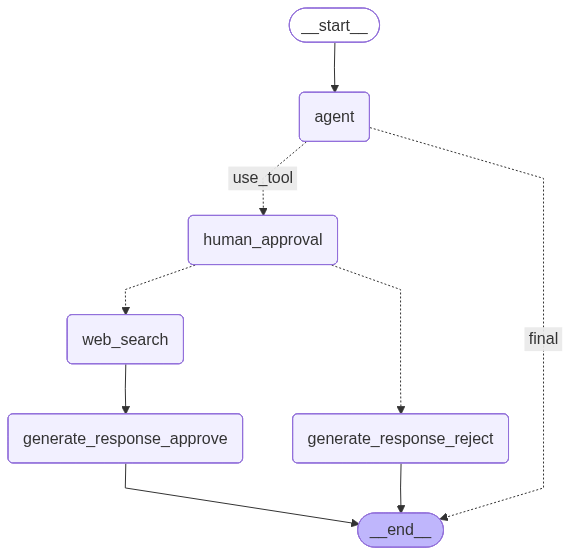

# A Human In The Loop LangGraph LLM app template with function calling capabilities 🚀

## 📖 Table of Contents
* [Introduction](#-introduction)  
* [Directory structure and file descriptions](#-directory-structure-and-file-descriptions)  
* [Prerequisites](#-prerequisites)  
* [Installation](#-installation)
* [Configuration](#-configuration) 
* [Modifying and configuring the template](#-modifying-and-configuring-the-template)  
* [Testing the template](#-testing-the-template)  
* [Running the application locally](#-running-the-application-locally)  
* [Deploying on IBM Cloud](#-deploying-on-ibm-cloud) 
* [Querying the deployment](#-querying-the-deployment)  
* [Cloning template (Optional)](#-cloning-template-optional)  

## 🤔 Introduction

This repository provides a Human in the Loop Agent template for LLM apps built using the LangGraph framework. It also makes it easy to deploy them as an AI service as part of IBM watsonx.ai for IBM Cloud[^1].

An AI service is a deployable unit of code that encapsulates the logic of your generative AI use case. For an in-depth description of AI services, please refer to the [IBM watsonx.ai documentation](https://dataplatform.cloud.ibm.com/docs/content/wsj/analyze-data/ai-services-templates.html?context=wx&audience=wdp).

The template considers a human approval step when Agent decides to use a Web Search tool (by default, the [DuckDuckGo](https://python.langchain.com/docs/integrations/tools/ddg/) integration is used). When user do not approve the use of the tool (i.e. reply with message `"reject"`), in this case the agent responds as if it did not have access to this tool. The Graph was prepared based on the [LangGraph's Human in the Loop, Accept/Reject pattern](https://langchain-ai.github.io/langgraph/how-tos/human_in_the_loop/add-human-in-the-loop/#approve-or-reject).

Structure of Human in the Loop Agent workflow:



For a Quickstart guide, watch the [video](../../README.md#agent-with-human-in-the-loop-architecture) that demonstrates how to run the Human In the Loop LangGraph agent locally.

[^1]: _IBM watsonx.ai for IBM Cloud_ is a full and proper name of the component we're using in this template and only a part of the whole suite of products offered in the SaaS model within IBM Cloud environment. Throughout this README, for the sake of simplicity, we'll be calling it just an **IBM Cloud**.

**Highlights:**

* 🚀 Easy-to-extend agent and tool modules
* ⚙️ Configurable via `config.toml`
* 🌐 Step-by-step local and cloud deployment

## 🗂 Directory structure and file descriptions

The high level structure of the repository is as follows:  

```
langgraph-human-in-the-loop/
├── src/
│   └── langgraph_hitl/
│       ├── agent.py
│       └── tools.py
├── schema/
├── examples/
├── ai_service.py
├── config.toml.example
├── template.env
└── pyproject.toml
```

* **`langgraph-human-in-the-loop`** folder: Contains auxiliary files used by the deployed function. They provide various framework specific definitions and extensions. This folder is packaged and sent to IBM Cloud during deployment as a [package extension](https://dataplatform.cloud.ibm.com/docs/content/wsj/analyze-data/ml-create-custom-software-spec.html?context=wx&audience=wdp#custom-wml).  
* **`schema`** folder: Contains request and response schemas for the `/ai_service` endpoint queries.
* **`examples`** folder: Contains auxiliary scripts for running chat session in the terminal. Aligned with the template request/response schema.  
* **`ai_service.py`** file: Contains the function to be deployed as an AI service defining the application's logic  
* **`config.toml.example`**: A configuration file with placeholders that stores the deployment metadata. After downloading the template repository, copy the contents of the `config.toml.example` file to the `config.toml` file and fill in the required fields. `config.toml` file can also be used to tweak the model for your use case. 
* **`template.env`**: A file with placeholders for necessary credentials that are essential to run some of the `ibm-watsonx-ai-cli` commands and to test agent locally. Copy the contents of the `template.env` file to the `.env` file and fill the required fields.

## 🛠 Prerequisites

* **Python 3.11**
* **[Poetry](https://python-poetry.org/)** package manager (install via [pipx](https://github.com/pypa/pipx))
* IBM Cloud access and permissions

## 📥 Installation

To begin working with this template using the Command Line Interface (CLI), please ensure that the IBM watsonx AI CLI tool is installed on your system. You can install or upgrade it using the following command:

1. **Install CLI**:

   ```sh
   pip install -U ibm-watsonx-ai-cli
   ```

2. **Download template**:
   ```sh
   watsonx-ai template new "base/langgraph-human-in-the-loop"
   ```

   Upon executing the above command, a prompt will appear requesting the user to specify the target directory for downloading the template. Once the template has been successfully downloaded, navigate to the designated template folder to proceed.

> [!NOTE]
> Alternatively, it is possible to set up the template using a different method. For detailed instructions, please refer to the section "[Cloning template (Optional)](#-cloning-template-optional)".

3. **Install Poetry**:

   ```sh
   pipx install --python 3.11 poetry
   ```

4. **Install the template**:

    Running the below commands will install the repository in a separate virtual environment
   
   ```sh
   poetry install --with dev
   ```

5. **(Optional) Activate the virtual environment**:

   ```sh
   source $(poetry -q env use 3.11 && poetry env info --path)/bin/activate
   ```

6. **Export PYTHONPATH**:

   Adding working directory to PYTHONPATH is necessary for the next steps.

   ```sh
   export PYTHONPATH=$(pwd):${PYTHONPATH}
   ```

## ⚙️ Configuration

1. Copy `template.env` → `.env`.
2. Copy `config.toml.example` → `config.toml`.
3. Fill in IBM Cloud credentials.

## 🎨 Modifying and configuring the template

[config.toml](config.toml) and [.env](.env) files should be filled in before either deploying the template on IBM Cloud or executing it locally.  
Possible config parameters are given in the provided file and explained using comments (when necessary).  


The template can also be extended to provide additional key-value data to the application. Create a special asset from within your deployment space called _Parameter Sets_. Use the _watsonx.ai_ library to instantiate it and later reference it from the code.  
For detailed description and API please refer to the [IBM watsonx.ai Parameter Set's docs](https://ibm.github.io/watsonx-ai-python-sdk/core_api.html#parameter-sets)  


Sensitive data should not be passed unencrypted, e.g. in the configuration file. The recommended way to handle them is to make use of the [IBM Cloud® Secrets Manager](https://cloud.ibm.com/apidocs/secrets-manager/secrets-manager-v2). The approach to integrating the Secrets Manager's API with the app is for the user to decide on.  


The [agent.py](src/langgraph/agent.py) file builds app the graph consisting of nodes and edges. The former define the logic for agents while the latter control the logic flow in the whole graph.  
For detailed info on how to modify the graph object please refer to [LangGraph's official docs](https://langchain-ai.github.io/langgraph/tutorials/multi_agent/multi-agent-collaboration/#create-graph)  


The [ai_service.py](ai_service.py) file encompasses the core logic of the app alongside the way of authenticating the user to the IBM Cloud.  
For a detailed breakdown of the ai-service's implementation please refer the [IBM Cloud docs](https://dataplatform.cloud.ibm.com/docs/content/wsj/analyze-data/ai-services-create.html?context=wx)  


[tools.py](src/langgraph_hitl/tools.py) file stores the definition for tools enhancing the chat model's capabilities.  
In order to add new tool create a new function, wrap it with the `@tool` decorator and add to the `TOOLS` list in the `extensions` module's [__init__.py](src/langgraph_hitl/__init__.py)

For more sophisticated use cases (like async tools), please refer to the [langchain docs](https://python.langchain.com/docs/how_to/custom_tools/#creating-tools-from-runnables).  

## 🧪 Testing the template

The `tests/` directory's structure resembles the repository. Adding new tests should follow this convention.  
For exemplary purposes only the tools and some general utility functions are covered with unit tests.  

Running the below command will run the complete tests suite:
```sh
pytest -r 'fEsxX' tests/
```

## 💻 Running the application locally

It is possible to run (or even debug) the ai-service locally, however it still requires creating the connection to the IBM Cloud.

Ensure `config.toml` and `.env` are configured.

You can test and debug your AI service locally via two alternative flows:

### ✅ Recommended flow: Python Scripts

Agent with the Human in the Loop structure includes a human approval node that requires a custom request/response schema. When Agent from the first graph node decides to use Web Search tool, the response object that is send to the user contains additional field `"thread_id"`:

```
{
  "choices": [
    {
      "index": 0,
      "message": {
        "role": "assistant",
        "content": "Do you approve the following output?\n\nTool Name: duckduckgo_results_json\nTool argument: {\"query\": \"What is a loan?\"}\n\nIf you approve the call respond with `approve`, and `reject` otherwise."
      }
    }
  ],
  "thread_id": "5b92aac4-30d9-44a6-8918-84597af92e61"
}
```
To approve/reject the tool usage and continue the conversation, one need to send back the request including the proper `thread_id`, i.e.

```
{
  "messages": [
    {
      "role": "user",
      "content": "approve"
    }
  ],
  "thread_id": "109beb6f-4c45-4f64-ab34-ca62a961d611"
}
```

Since the AI service with a Human in the Loop agent implemented may return non-standard responses, we recommend using specially prepared scripts to conduct chat sessions with the Human in the Loop agent. 

```sh
python ./examples/execute_ai_service_locally.py

The following commands are supported:
  --> help | h : prints this help message
  --> quit | q : exits the prompt and ends the program
  --> list_questions : prints a list of available questions


Choose a question or ask one of your own.
 --> Could you describe briefly the new Granite 4 LLM?

 ============================== Assistant Message ===============================
[{'id': 'chatcmpl-tool-09a5ed96dee541ea87c07d7cad9866ef', 'type': 'function', 'function': {'name': 'duckduckgo_results_json', 'arguments': '{"query": "Granite 4 LLM"}'}}]
 ============================== Assistant Message ===============================
Do you approve the following output?

Tool Name: duckduckgo_results_json
Tool argument: {"query": "Granite 4 LLM"}

If you approve the call respond with `approve`, and `reject` otherwise.

Choose a question or ask one of your own.
 --> approve
✅ Approved path taken.

 ================================= Tool Message =================================
[{"snippet": "August 28, 2025 - IBM Granite is a series of decoder-only AI foundation models created by IBM . It was announced on September 7, 2023, and an initial paper was published 4 days later. Initially intended for use in the IBM's cloud-based data and generative AI platform Watsonx along with other models, IBM opened ...", "title": "Wikipedia IBM Granite - Wikipedia", "link": "https://en.wikipedia.org/wiki/IBM_Granite"}, {"snippet": "May 5, 2025 - It will be officially released this summer as part of a model lineup that also includes Granite 4 .0 Small and Granite 4 .0 Medium. Granite 4 .0 continues IBM’s firm commitment to making efficiency and practicality the cornerstone of its enterprise LLM development.", "title": "IBM IBM Granite 4.0 Tiny Preview: A sneak peek at the next generation of Granite models", "link": "https://www.ibm.com/new/announcements/ibm-granite-4-0-tiny-preview-sneak-peek"}, {"snippet": "1 week ago - We’re launching Granite 4, the ... models. Granite 4.0 features a new hybrid Mamba/transformer architecture that greatly reduces memory requirements without sacrificing performance . They can be run on significantly cheaper GPUs and at significantly reduced costs compared to conventional LLMs...", "title": "IBM IBM Granite 4.0: Hyper-efficient, High Performance Hybrid Models for Enterprise", "link": "https://www.ibm.com/new/announcements/ibm-granite-4-0-hyper-efficient-high-performance-hybrid-models"}, {"snippet": "1 week ago - Granite-4.0 H-Small with a score of 0.86 on IF-Eval is approaching top models like Llama 4 Maverick and Kimi K2 , while Micro holds a solid position in the middle of the table alongside Mistral and OLMo. For models of this size, this is a very serious statement.", "title": "DEV Community Granite 4: IBM introduces a line of small but fast LLMs - DEV Community", "link": "https://dev.to/herasimau/granite-4-ibm-introduces-a-line-of-small-but-fast-llms-oad"}]
 ============================== Assistant Message ===============================
The new Granite 4 LLM is a series of decoder-only AI foundation models created by IBM. It features a new hybrid Mamba/transformer architecture that reduces memory requirements without sacrificing performance, allowing it to be run on cheaper GPUs and at reduced costs compared to conventional LLMs. The model is part of a lineup that includes Granite 4.0 Small and Granite 4.0 Medium, and it has shown promising results in terms of performance, with the H-Small model approaching top models like Llama 4 Maverick and Kimi K2.

Choose a question or ask one of your own.
 --> 
```

## ☁️ Deploying on IBM Cloud

Follow these steps to deploy the model on IBM Cloud. 

Ensure `config.toml` and `.env` are configured.

You can deploy your AI service to IBM Cloud via two alternative flows:

### ✅ Recommended flow: CLI

```sh
watsonx-ai service new
```

*Config file updates automatically with `deployment_id`.*

## 🔍 Querying the deployment

You can send inference requests to your deployed AI service via two alternative flows:

### ✅ Recommended flow: Python Scripts

Before running the script `query_existing_deployment.py`, please replace `"PLACEHOLDER FOR YOUR DEPLOYMENT ID"` in it with the correct deployment id.

```sh
python ./examples/qu
ery_existing_deployment.py 
```

> [!WARNING]
> Due to the non-standard response/request pattern, which is not compatible with the simple chat API, it may not be possible to conduct the conversation session in the preview tab of the IBM Data Platform user interface.

---

**Enjoy your coding! 🚀**

---


## 💾 Cloning template (Optional)

1. **Clone the repo** (sparse checkout):

   In order not to clone the whole `IBM/watsonx-developer-hub` repository we'll use git's shallow and sparse cloning feature to checkout only the template's directory:  
   
   ```sh
   git clone --no-tags --depth 1 --single-branch --filter=tree:0 --sparse https://github.com/IBM/watsonx-developer-hub.git
   cd watsonx-developer-hub
   git sparse-checkout add agents/base/langgraph-react-agent
   cd agents/base/langgraph-react-agent/
   ```

> [!NOTE]
> From now on it'll be considered that the working directory is `watsonx-developer-hub/agents/base/langgraph-react-agent/`  
