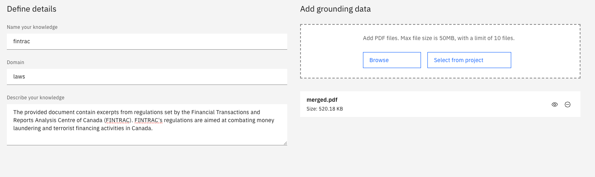
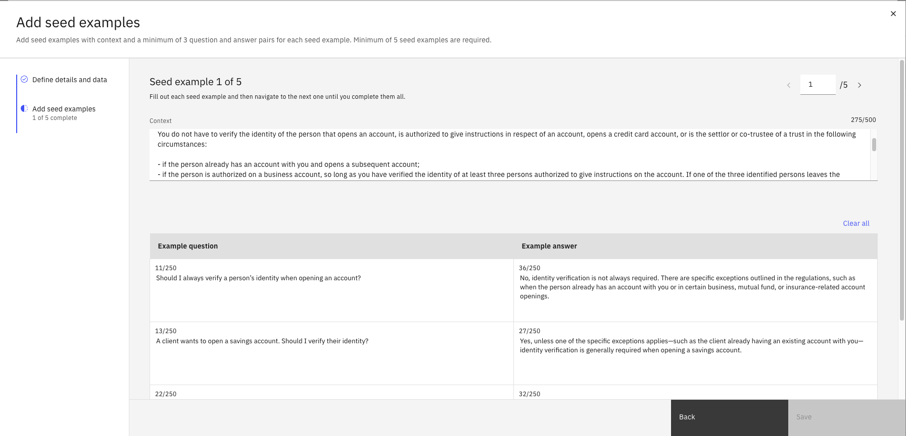

# Instructlab Use Case Examples
A collection of sample use cases to help users get started with Instructlab on watsonx.ai. Use these sample question and answer documents to get started with customizing your own model with Instructlab.

## Skills
### Ungrounded Skills 
- (Coming soon)
### Grounded Skills
- [Python test case generation](SDLC%20-%20Test%20case%20generation)

## Knowledge
- [Anti Money Laundering](Anti%20Money%20Laundering)
- [EU AI Act](EU%20AI%20act)

# Getting started

You can get started with one of the examples in this repo, or craft your own knowledge or skill to customize your model. There are two ways to use instructlab on watsonx.ai: 1) Using the watsonx.ai UI 2) Using the watsonx.ai SDK

## Getting started- watsonx.ai UI

1. Follow the instructions [here](placeholder) to create a tuning experiment on watsonx.ai and import your taxonomy.
2. Add a new skill or knowledge node to the taxonomy.
3. Fill in the fields as follows:  
- Name your knowledge: the name of the node  
- Domain: domain of the knowledge (domain field from from qna.yaml file)  
- Describe your knowledge: summary of the dataset (document outline field from qna.yaml file)  
- Add Grounding Data (if adding knowledge): Upload the pdf file, or select an existing one from the project assets.  
  

4. Add your seed questions and answers. You can copy and paste the sample questions and answers or create your own.
  

## Getting started- watsonx.ai SDK
1. Follow the instructions [here](placeholder) to create a tuning experiment and import your taxonomy.
2. Update the taxonomy tree with your new seed question and answers.
3. Continue with synthetic data generation, tuning, and deployment.

# Additional Resources

- Instructlab taxonomy: https://github.com/instructlab/taxonomy/tree/main  
- Taxonomy documentation: https://docs.instructlab.ai/taxonomy/  
- Skills best practices: https://docs.instructlab.ai/taxonomy/skills/  
- Knowledge best practices: https://docs.instructlab.ai/taxonomy/knowledge/  
